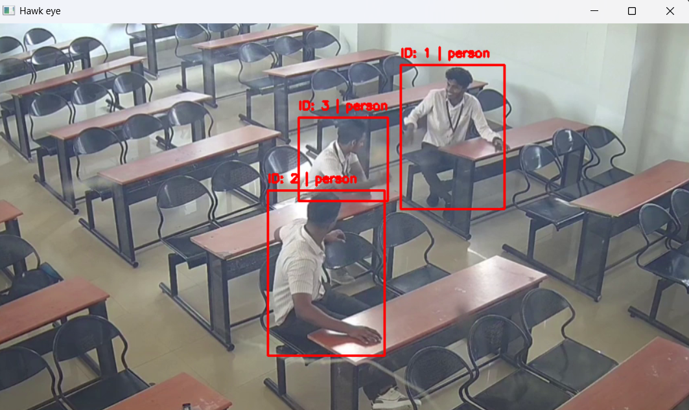
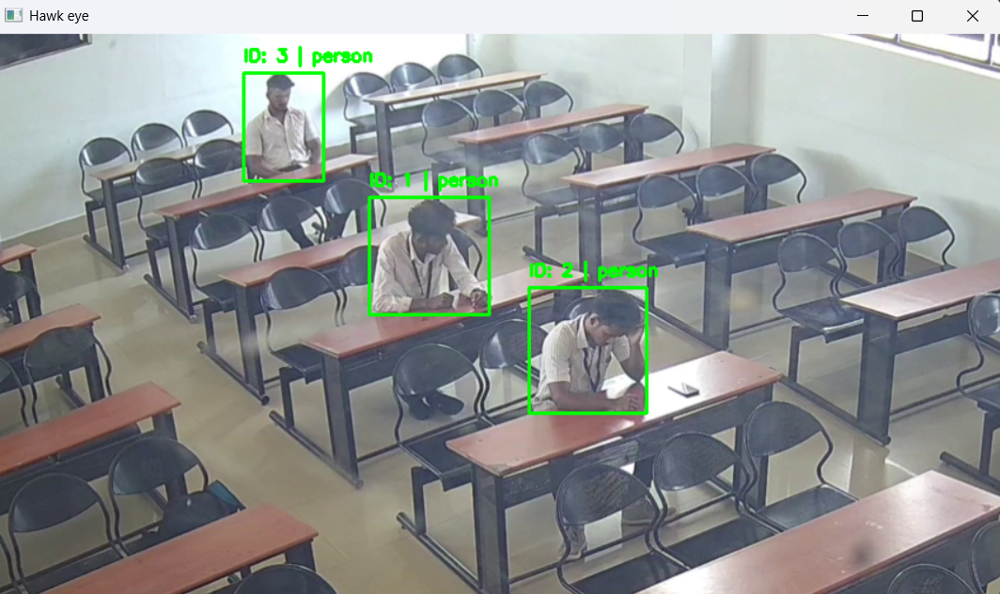

# Hawk eye (exam hall cheating detection system) 

## Overview
This project aims to develop a system for exam hall cheating detection It utilizes LSTM (Long Short-Term Memory) networks for gesture recognition and MediaPipe for hand tracking and landmark detection.

## Algorithm
 - First we track persons using deepsort and yolo
 - pass each detections through pose detection model 
 - Extract pose landmarks
 - collect landmarks for n number of frames for each persons 
 - pass landmark sequence to classfier model to get peredection (cheatin/non cheating)
 - show aleart (red box)

## Results
<p float="left">
  
  
</p>


## Requirements
- Python 3.11
- PyTorch
- ultralytics
- OpenCV
- Additional Python Libraries (scikit-learn, huggingface_hub, etc.)

## Installation

### Clone the Repository
Clone the project repository to your local machine:
```bash
git clone https://github.com/abhi107d/hawk_eye.git
cd hawk_eye
```
### If no nvidia gpu
```bash
conda create -p ./installer_files/env python=3.11
conda activate ./installer_files/env
pip install -r requirements-cpu.txt

```

### If nvidia gpu is available
Run installer/windows_run.bat

## Usage
Run installer/windows_run.bat


## Training

### Step 1:
Preprocessing
```bash
python -m src.components.database_builder --videosrc "videos_test/cheating.mp4" --label 1 --show True #example usage
```
- videosrc = Sorce video
- label = 1 for cheating class and 2 for non cheating class
- show = If True shows video and detections 
- seqlen = Sequence length of video default 20
- database =  Path to database location

### Step 2:
Training
```bash
python -m src.components.model_trainer  #example usage
```
### Step 3:
Testing
```bash
python -m src.components.model_trainer --modelpath models/model.pth  #example usage
```

## Notes
- Ensure that you have a compatible GPU and drivers installed for CUDA Toolkit and cuDNN.
- model is not accurate we need to collect more data

## :TODO
- Develop UI
- Aleart system 

## Acknowledgments
- PyTorch: [https://pytorch.org/](https://pytorch.org/)
- YOLO


